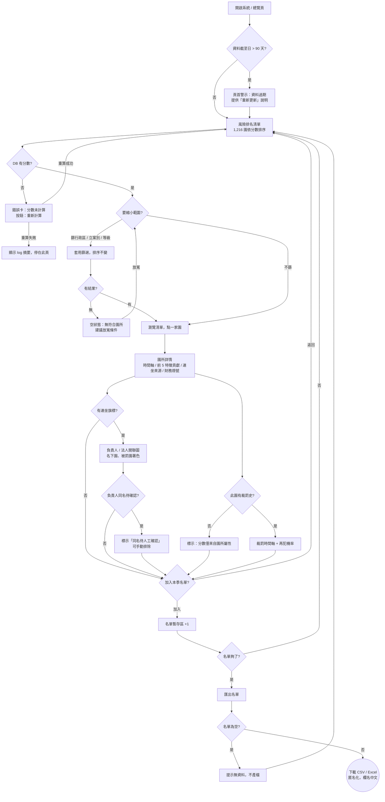
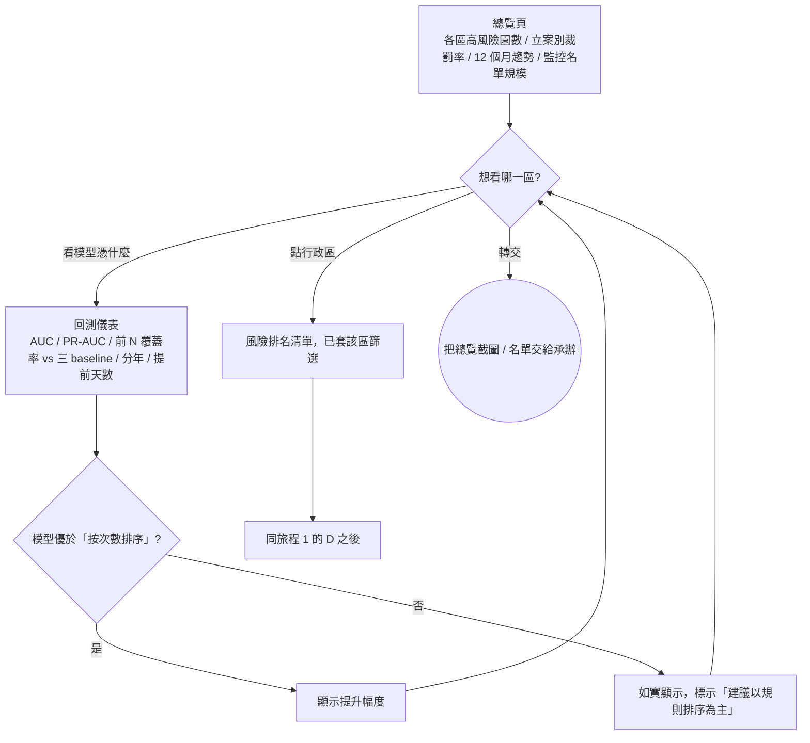
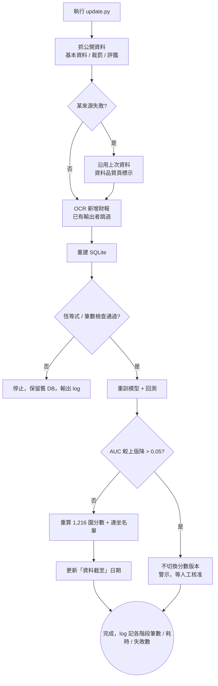

# Smart Watchdog 使用者流程

三個角色、三條旅程。稽查承辦是主線；科長從總覽切入同一條線；資料維護者走 CLI。

## 旅程 1：稽查承辦 —— 排下一季優先名單（主線）

入口：總覽頁（demo 開場）或側欄「風險排名」。成功：匯出名單檔。

## 旅程 2：科長 —— 決定各區人力配置

入口：總覽頁。成功：看到各區高風險數並轉交名單。

## 旅程 3：資料維護者 —— 更新資料與重算（CLI）

入口：終端機 `python scripts/update.py`。成功：資料截至日更新、分數版本切換或警示。

## 畫面清單

| # | 畫面 | 目的 | 關鍵元素 | US |
|---|---|---|---|---|
| 1 | 總覽 | 主管一眼看全市風險分布 | 行政區高風險數（地圖或長條）、立案別裁罰率、12 個月裁罰趨勢、監控名單總數、資料截至日、進入排名／回測入口 | US-7 |
| 2 | 風險排名清單 | 承辦挑園 | 表格（園名、區、類型、分數、等級、連坐旗標、最近裁罰、次數）、篩選列、「加入名單」按鈕、名單暫存計數、匯出按鈕、資料過期警示、空狀態、錯誤卡 | US-1, US-5 |
| 3 | 園所詳情 | 說明分數理由 | 分數與等級、裁罰時間軸、前 5 特徵貢獻（正負）、連坐來源、財務燈號區（非營利／公立才顯示）、「無裁罰史」標示、返回／加入名單 | US-2 |
| 4 | 負責人／法人關聯圖 | 一次看相關園 | 圖（負責人或法人節點、園節點、被罰著色、邊標次數）、同名待確認標示、手動排除、名下園清單 | US-3 |
| 5 | 回測儀表 | 回答「憑什麼」 | AUC／PR-AUC、前 50/100/200 覆蓋率、三 baseline 並列、分年結果、提前天數分布、模型不優於規則時的標示 | US-4 |
| 6 | 匯出對話框 | 產出名單 | 欄位預覽、匿名化說明、格式選擇（CSV／Excel）、空名單提示 | US-5 |
| 7 | 資料品質頁 | 維護者與評審看資料狀態 | 各表筆數、資料截至日、來源抓取狀態、負責人缺值數、OCR 恆等式通過率、分數版本與 AUC 歷史 | US-6 |

CLI 更新流程不算畫面，輸出走 log 與資料品質頁。
