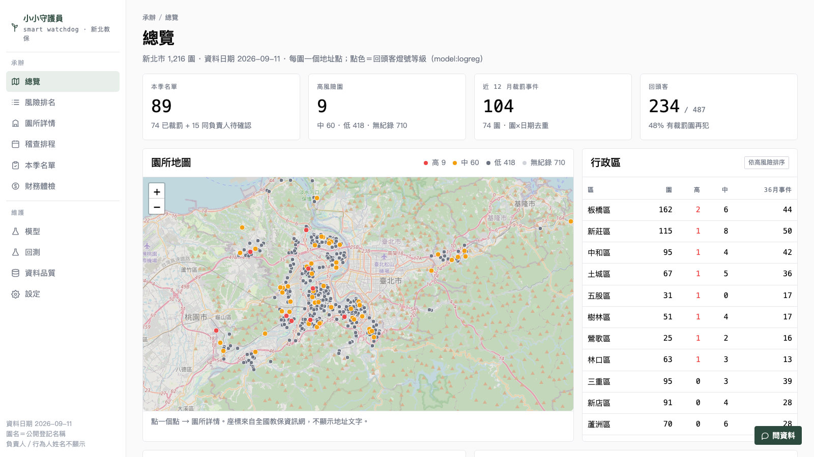
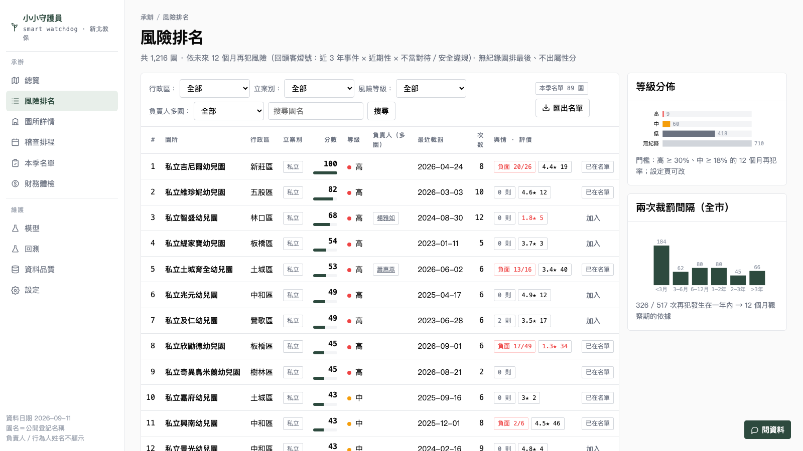
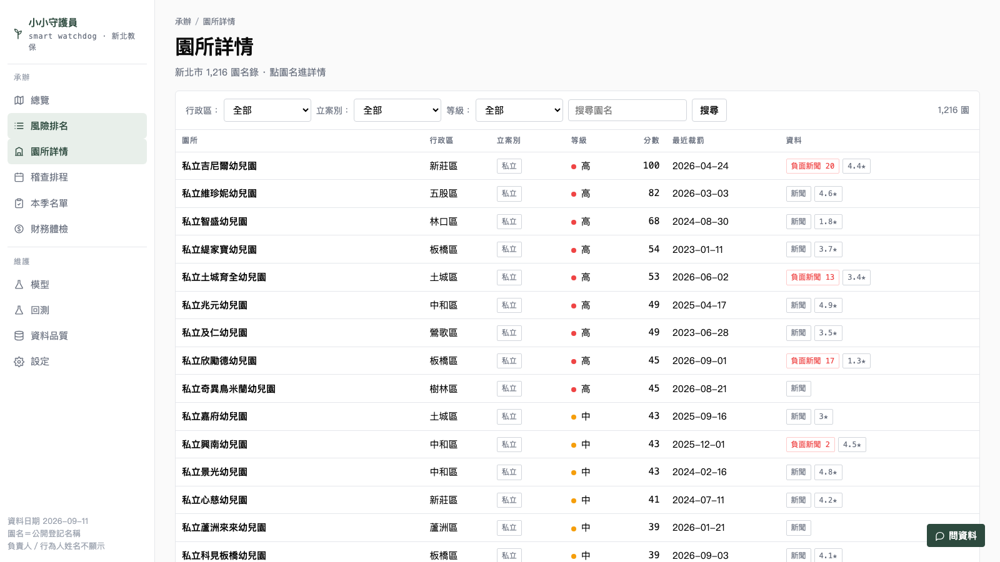
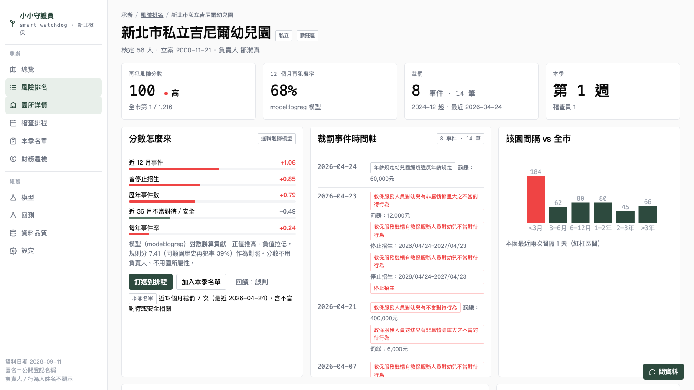
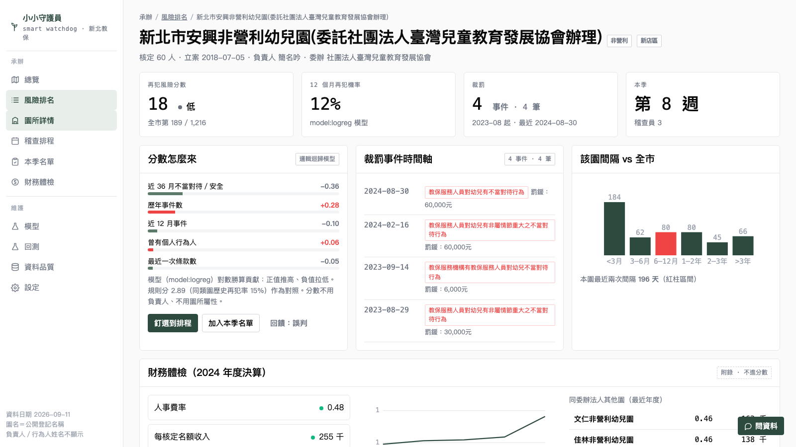
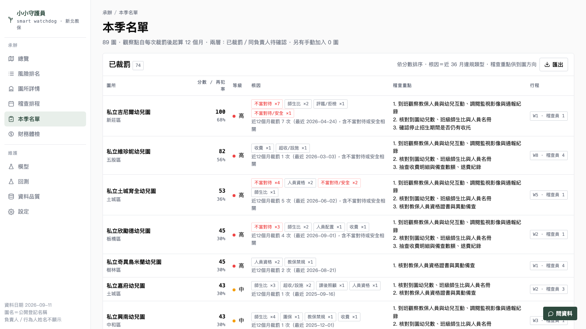
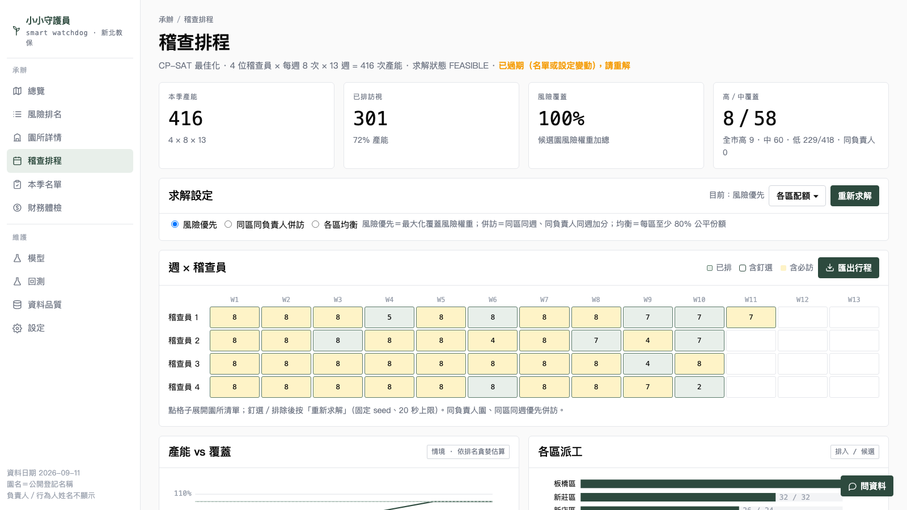
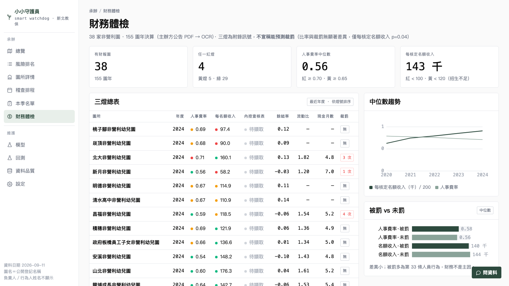
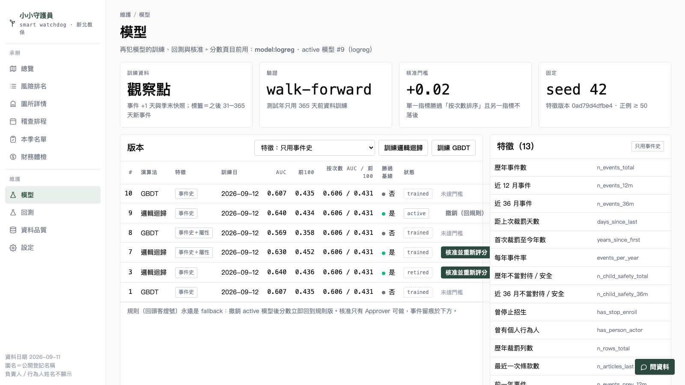

# 小小守護員 Smart Watchdog — 使用手冊

版本 2026-09-12 · 適用對象：教育局幼教科承辦、稽查員、資料維護者

**一句話**：這套系統每季幫你回答三個問題——該去哪（本季名單）、為什麼（分數與根因）、跑得完（週×稽查員行程）。資料全部來自公開來源，園名為公開登記名稱，負責人姓名為公開登記資料；被裁罰的個人姓名不會出現在任何畫面。

---

## 1. 安裝與啟動

需求：macOS 或 Linux、Python 3.12 以上、網路（只在抓取公開資料與輿情時需要）。

```bash
git clone https://github.com/mumigood/NTPC-childcare-risk-monitor
cd NTPC-childcare-risk-monitor
make bootstrap          # 安裝套件 → 沒有本地資料就用內建示範資料庫 → 評分 → 排程 → 開服務
```

瀏覽器開 http://localhost:8765/ 。第一次約 3–5 分鐘（排程求解 20 秒）。

| 指令 | 用途 |
|---|---|
| `make serve` | 只開服務（資料已就緒） |
| `make update` | 離線重算：勾稽 → 評分 → 排程 |
| `make update FETCH=1` | 先從全國教保資訊網鏡像抓最新園所與裁罰資料再重算 |
| `make update TRAIN=1` | 重新訓練模型（見第 9 節） |
| `make test` | 跑 35 條自動測試 |
| `python3 scripts/sentiment_batch.py --top 100` | 抓前 100 名的新聞與 Google 評價（見第 7 節） |

選用金鑰放在專案根目錄的 `.env`（不會進版本控制）：

```
ANTHROPIC_API_KEY=...     # 右下「問資料」抽屜；沒設就停用，其餘功能不受影響
GOOGLE_MAPS_API_KEY=...   # Google 評價；需開啟 Places API (New)
```

---

## 2. 畫面總覽

左側欄分兩區。**承辦**是每季要走的主線，**維護**是資料與模型的後台。

| 區 | 頁 | 回答的問題 |
|---|---|---|
| 承辦 | 總覽 | 全市現在什麼狀況？哪一區最需要注意？ |
| 承辦 | 風險排名 | 1,216 園依再犯風險排序，誰在前面、為什麼？ |
| 承辦 | 園所詳情 | 這一家的分數、裁罰史、負責人關聯、財報、輿情 |
| 承辦 | 稽查排程 | 這季 3 位稽查員每週去哪幾家？ |
| 承辦 | 本季名單 | 非去不可的園，以及到園要看什麼 |
| 承辦 | 財務體檢 | 38 家非營利園的財務三燈 |
| 維護 | 模型 | 訓練、回測、核准再犯模型 |
| 維護 | 回測 | 歷年回測曲線與 ROI 重播 |
| 維護 | 資料品質 | 資料來源、筆數、檢查、更新紀錄 |
| 維護 | 設定 | 人力、門檻、觀察期 |

右下角「問資料」是唯讀問答抽屜，每頁有三個建議問題。

---

## 3. 總覽



- **四個數字**：本季名單園數（已裁罰＋同負責人待確認）、高風險園數、近 12 個月裁罰事件、回頭客比例。
- **地圖**：每園一個點，點色＝等級（紅高、黃中、灰低、淡灰無紀錄）。滑鼠停留看園名與排名，點下去進詳情。
- **行政區表**：依高風險園數排序，點一列就跳到該區的排名。
- **36 個月趨勢**與**區 × 違規類型熱圖**：看哪一區、哪一類違規最集中。
- 頁尾的提醒是刻意放的：系統排的是「未來 12 個月內再被裁罰」的可能性，從未被稽查的園沒有紀錄可排，**無紀錄不等於安全**。

---

## 4. 風險排名



- **分數 0–100**：相對再犯風險，100 是全市最高；滑鼠停在分數上看理由。
- **等級**：依「12 個月再犯機率」的絕對門檻分高／中／低（預設高 ≥ 30%、中 ≥ 18%，設定頁可改）。無裁罰紀錄的園列「無紀錄」、已停辦列「停辦」，都排在最後、不出分數。
- **負責人（多園）**：同一負責人名下有兩家以上時顯示姓名，點進去看關聯圖。
- **輿情 · 評價**：負面新聞數／總數、Google 星等與評分數（需先跑批次抓取，第 7 節）。
- **篩選**：行政區、立案別、等級、負責人多園、園名關鍵字；每頁 25，有分頁。
- **加入／已在名單**：把園加進本季名單（手動層）。已在名單的是近 12 個月有裁罰的園，系統自動列入。
- **匯出名單**：Excel 或 CSV，含分數、等級、根因、稽查重點、負責人代碼；不含任何個人姓名。

---

## 5. 園所詳情

沒有選園時是**全市名錄**：篩選＋搜尋＋分頁，「資料」欄標記有財報、新聞、星等。



點一家進去，第一眼是四個結論：



1. **再犯風險分數**與等級、全市排名。
2. **12 個月再犯機率**：模型輸出。
3. **裁罰**：事件數與筆數（同一天多條法條算一個事件）、起訖日期。
4. **本季**：排在第幾週、哪位稽查員；或名單狀態。

往下：

- **分數怎麼來**：模型對每個特徵的貢獻（正值推高、負值拉低），並附規則版對照。這裡也有「釘選到排程」「加入本季名單」「回饋：誤判」三個按鈕。
- **裁罰事件時間軸**：每一筆寫**具體違反什麼**（例：教保人員對幼兒不當對待、超收、師生比）與罰鍰，紅框是不當對待或安全相關。
- **該園間隔 vs 全市**：本園最近兩次裁罰間隔落在全市分佈的哪一段。
- **財務體檢**（只有非營利園有）：三燈、五年趨勢、同委辦法人其他園比較。



- **負責人關聯圖**：中心是負責人，周圍是名下園所；紅邊＝有裁罰，虛線＝無裁罰。可「排除同名」（同名不同人時）。
- **輿情分析**：Google 新聞近況、負面關鍵字命中、Google 評價與最新評論。**輿情不進分數**，只做到園前的情蒐；同名園可能混入，請點連結確認。

---

## 6. 本季名單



兩層：

- **已裁罰**：近 12 個月（可在設定改）有裁罰事件的園，必訪。每列有分數／再犯率、**根因**（近 36 月違規類型計數）、**稽查重點三行**（由違規類型推出的到園動作，例如調閱監視影像、核對師生比、抽查收費）、排在第幾週。
- **同負責人待確認**：負責人名下其他園，人工確認用，不進分數；可「排除同名」，排除後排名、匯出、關聯圖同步更新。

「再犯累積曲線」是歷史事件裁罰後 N 個月內再犯的比例，12 個月約三成，這是觀察期設 12 個月的依據。

---

## 7. 稽查排程



- 產能 = 稽查員人數 × 每人每週次數 × 週數（設定頁）。
- **求解設定**：三種目標——風險優先（預設）、同區同負責人併訪、各區均衡；「各區配額」可為每一區設下限／上限。改完按「重新求解」，約 20 秒。
- **週 × 稽查員**格子：數字是該週該人排幾家；點格子展開園所清單，可**釘選**（固定在某週某人）或**排除**，再按重新求解。
- 硬規則：名單必訪、產能不可超、停辦園不排。不可行時會直接說原因（例如各區下限總和超過產能）。
- 排程受名單或設定變動影響時會標「已過期，請重解」。
- **匯出行程**：Excel／CSV，每列一園含週次、稽查員、理由。

---

## 8. 財務體檢



只涵蓋有公告決算的 38 家非營利園（私立園無公開財報）。三燈：

| 燈 | 紅 | 黃 | 意義 |
|---|---|---|---|
| 人事費率 | ≥ 0.70 | ≥ 0.65 | 人事費占支出比例過高 |
| 每核定名額收入 | < 100 千 | < 120 千 | 招生不足 |
| 內控查核表 | 待擷取 | | 尚未從 PDF 擷取 V/X |

財務燈號**不進風險分數**：它回答「補助的錢有沒有花對」，不是「會不會被罰」。歷史資料顯示被罰與未罰園的財務比率幾乎相同。

---

## 9. 模型（維護）



- 分數頁目前用哪個模型、規則版永遠是備援。
- **訓練**：選特徵組（預設只用事件史；「事件史＋屬性」僅供比較），按訓練邏輯迴歸或 GBDT，約 30–60 秒。
- 每個版本顯示 AUC、前 100 覆蓋率、與「按次數排序」基線的比較、是否勝過基線。**核准門檻**：單一指標勝過基線 0.02 且另一指標不落後。
- 每個版本的回測卡有**混淆矩陣**（中／高兩種門檻）、accuracy、balanced accuracy、precision、recall、specificity、F1、Cohen's κ、Brier、log loss。看法：排序工具看 AUC／覆蓋率；門檻指標看「按等級去稽查會抓到多少、白跑多少」。
- **核准並重新評分**：只有勝過基線的版本可核准；核准後全市重新評分、排程標過期。**撤銷**即回規則版。所有動作留痕於「事件留痕」。

---

## 10. 回測、資料品質、設定

- **回測**：逐年 AUC 與前 100 覆蓋率曲線（模型、規則、按次數、按近期）、提前天數分佈、ROI 重播（同樣人力，規則排程命中次年被罰園 40–53%，輪流 25–28%）。
- **資料品質**：來源筆數、座標齊全、負責人欄空白數、同名待確認數、去識別測試、每次 `update.py` 的階段紀錄與失敗訊息。
- **設定**：稽查員人數、每人每週次數、季週數；高／中門檻、前 N、名單觀察期、資料過期天數。改門檻會立即重新評分並把排程標過期。

---

## 11. 問資料（問答抽屜）

右下角按鈕。只能讀去識別資料（無被罰個人姓名），沒有任何寫入工具，每一輪都留紀錄。問法例：

- 「板橋區近 12 個月被罰兩次以上的園有哪些？」
- 「排名第一的園為什麼是它？」
- 「本季名單裡哪些園同負責人？」

沒有設定 `ANTHROPIC_API_KEY` 時抽屜顯示停用，其餘功能不受影響。

---

## 12. 每季標準流程（建議）

1. `make update FETCH=1`（或資料品質頁確認資料日期未過期）。
2. 總覽看全市與各區狀況。
3. 本季名單：看已裁罰層與同負責人待確認層，排除同名、手動加入需要的園。
4. 稽查排程：選目標、設各區配額、釘選／排除，重新求解，匯出行程。
5. 到園前開園所詳情：分數怎麼來、時間軸、根因、稽查重點、輿情。
6. 有誤判就在詳情頁按「回饋：誤判」，記下來供下一版模型參考。

---

## 13. 常見訊息

| 訊息 | 意思 | 處理 |
|---|---|---|
| 尚未評分 | 資料庫沒有目前批次 | `make update` |
| 尚未排程 | 沒有目前排程 | 排程頁按「立即求解」 |
| 已過期（名單或設定變動），請重解 | 名單／設定改了，排程是舊的 | 重新求解 |
| 各區下限總和超過產能 | 配額設太高 | 降低下限或增加人力 |
| 釘選園不存在或已停辦 | 釘選的園 id 錯 | 從格子裡釘選 |
| active 模型檔不存在，改用規則 | 模型檔遺失 | 模型頁重新訓練並核准 |
| 未設定 ANTHROPIC_API_KEY，問答停用 | 沒金鑰 | 放進 `.env` 後重啟 |
| 無法連線新聞來源 | 離線 | 有網路再按「重新抓取」 |

---

## 14. 個資與資料來源

- 園所名稱、負責人姓名：全國教保資訊網公開登記資料。
- 裁罰紀錄：全國教保資訊網（kiang 鏡像），行為人姓名在資料層即不對外提供。
- 非營利園財報：新北幼教資源網主辦方公告 PDF → OCR → 恆等式檢核。
- 輿情：Google 新聞 RSS 標題；Google 評價（需金鑰）。評論為使用者自寫內容，問答抽屜不讀評論全文。
- 匯出檔不含任何個人姓名；金鑰只存在本機 `.env`。
